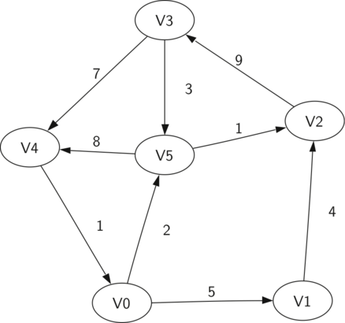

# Graph Abstract Data Type
  * Graphs are an abstract data type that can be used to represent many interesting things about our world, including systems of roads, airline flights from city to city, how the Internet is connected, or even the sequence of classes you must take to complete a major in computer science. Once there is a good representation for a problem, we can use some standard graph algorithms to solve what otherwise might seem to be a very difficult problem.
  * A Graph is an abstract data type that can be represented as a collection of verticies and edges that connect 2 given verticies. To more formally define a graph, it is helpful to start with a description of its components.
    * Vertex
      * A vertex (also called a “node”) is a fundamental part of a graph. It can have a name, which we will call the “key.” A vertex may also have additional information. We will call this additional information the “payload.”
    * Edge
      * An edge (also called an “arc”) is another fundamental part of a graph. An edge connects two vertices to show that there is a relationship between them. Edges may be one-way or two-way. If the edges in a graph are all one-way, we say that the graph is a directed graph, or a digraph. The class prerequisites graph shown above is clearly a digraph since you must take some classes before others.
    * Weight
      * Edges may be weighted to show that there is a cost to go from one vertex to another. For example in a graph of roads that connect one city to another, the weight on the edge might represent the distance between the two cities.
  * With these definitions in hand, we can more formally define a graph. A graph can be represented by G where G=(V,E). For the graph G, V is a set of vertices and E is a set of edges. Each edge is a tuple (v,w) where w,v ∈ V. We can add a third component to the edge tuple to represent a weight. A subgraph s is a set of edges e and vertices v such that e⊂E and v⊂V.
  * The figure below shows an example of a simple weighted digraph. Formally we can represent this graph as the set of six vertices:
    ```V={V0,V1,V2,V3,V4,V5}```
    and the set of nine edges:
    ```E={(v0,v1,5),(v1,v2,4),(v2,v3,9),(v3,v4,7),(v4,v0,1),(v0,v5,2),(v5,v4,8),(v3,v5,3),(v5,v2,1)}```

    
  * This example graph helps to illustrate two other key terms:
    * Path
      * A path in a graph is a sequence of vertices that are connected by edges. Formally we would define a path as w1,w2,...,wn such that (wi,wi+1)∈E for all 1≤i≤n−1. The unweighted path length is the number of edges in the path, specifically n−1. The weighted path length is the sum of the weights of all the edges in the path. For example in Figure 2 the path from V3 to V1 is the sequence of vertices (V3,V4,V0,V1). The edges are {(v3,v4,7),(v4,v0,1),(v0,v1,5)}.
    * Cycle
      * A cycle in a directed graph is a path that starts and ends at the same vertex. For example, in Figure 2 the path (V5,V2,V3,V5) is a cycle. A graph with no cycles is called an acyclic graph. A directed graph with no cycles is called a directed acyclic graph or a DAG. We will see that we can solve several important problems if the problem can be represented as a DAG.

  * With these formal definitions in mind, we can define the Graph abstract data type(ADT) as follows:
    * Graph() creates a new, empty graph.
    * addVertex(vert) adds an instance of Vertex to the graph.
    * addEdge(fromVert, toVert) Adds a new, directed edge to the graph that connects two vertices.
    * addEdge(fromVert, toVert, weight) Adds a new, weighted, directed edge to the graph that connects two vertices.
    * getVertex(vertKey) finds the vertex in the graph named vertKey.
    * getVertices() returns the list of all vertices in the graph.
    * in returns True for a statement of the form vertex in graph, if the given vertex is in the graph, False otherwise.
  * Beginning with the formal definition for a graph there are several ways we can implement the graph ADT in Python. We will see that there are trade-offs in using different representations to implement the ADT described above. There are two well-known implementations of a graph, the adjacency matrix and the adjacency list. We will explain both of these options, and implement them as Python classes.
    * [Adjacency Matrix Explanation and Implementation](adjacency-matrix/README.md)
    * [Adjacency List Explanation and Implentation](adjacency-list/README.md)
  * [Algorithms Using the Graph ADT and Data Structure](graph-algos/README.md)