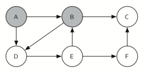

# Depth First Search
* Depth First Search is an algorithm using the Graph ADT and data structure that has many applications.
* First we will present different problems that can be solved using depth first search.
  * The Knight's Tour Problem
    * A classic problem that we can use to illustrate a common graph algorithm is called the “knight’s tour.” The knight’s tour puzzle is played on a chess board with a single chess piece, the knight.
    * The object of the puzzle is to find a sequence of moves that allow the knight to visit every square on the board exactly once. One such sequence is called a “tour.”
    * The knight’s tour puzzle has fascinated chess players, mathematicians and computer scientists alike for many years. The upper bound on the number of possible legal tours for an eight-by-eight chessboard is known to be 1.305×1035; however, there are even more possible dead ends.
    * Although researchers have studied many different algorithms to solve the knight’s tour problem, a graph search is one of the easiest to understand and program. Once again we will solve the problem using two main steps:
      * Represent the legal moves of a knight on a chessboard as a graph.
      * Use a graph algorithm to find a path of length (rows×columns)−1=(#OfVerts-1), where every vertex on the graph is visited exactly once.
    * Building the Graph
      * To represent the knight’s tour problem as a graph we will use the following two ideas: Each square on the chessboard can be represented as a node in the graph. Each legal move by the knight can be represented as an edge in the graph. The figure below illustrates the legal moves by a knight and the corresponding edges in a graph.
        
      * To build the full graph for an n-by-n board we can use the Python function shown below. The knightGraph function makes one pass over the entire board. At each square on the board the knightGraph function calls a helper, genLegalMoves, to create a list of legal moves for that position on the board. All legal moves are then converted into edges in the graph. Another helper function posToNodeId converts a location on the board in terms of a row and a column into a linear vertex number similar to the vertex numbers shown above.
        ```
        from pythonds.graphs import Graph

        def knightGraph(bdSize):
            ktGraph = Graph()
            for row in range(bdSize):
               for col in range(bdSize):
                   nodeId = posToNodeId(row,col,bdSize)
                   newPositions = genLegalMoves(row,col,bdSize)
                   for e in newPositions:
                       nid = posToNodeId(e[0],e[1],bdSize)
                       ktGraph.addEdge(nodeId,nid)
            return ktGraph

        def posToNodeId(row, column, board_size):
            return (row * board_size) + column

        def genLegalMoves(x,y,bdSize):
            newMoves = []
            moveOffsets = [(-1,-2),(-1,2),(-2,-1),(-2,1),
                           ( 1,-2),( 1,2),( 2,-1),( 2,1)]
            for i in moveOffsets:
                newX = x + i[0]
                newY = y + i[1]
                if legalCoord(newX,bdSize) and \
                                legalCoord(newY,bdSize):
                    newMoves.append((newX,newY))
            return newMoves

        def legalCoord(x,bdSize):
            if x >= 0 and x < bdSize:
                return True
            else:
                return False
        ```
      * The genLegalMoves function takes the position of the knight on the board and generates each of the eight possible moves. The legalCoord helper function (Listing 2) makes sure that a particular move that is generated is still on the board.
      * The figure below shows the complete graph of possible moves on an eight-by-eight board. There are exactly 336 edges in the graph. Notice that the vertices corresponding to the edges of the board have fewer connections (legal moves) than the vertices in the middle of the board. Once again we can see how sparse the graph is. If the graph was fully connected there would be 4,096 edges. Since there are only 336 edges, the adjacency matrix would be only 8.2 percent full.
        
    * Implementing the knights tour
      * The algorithm used to implement the knights tour is a modified version of the general depth first search algorithm. It is outlined above in the "Modified Depth First Search Algorithm" section.  


* Now we will outline and implement the depth first search algorithm on an instance of the Graph data structre.
  * Modified Depth First Search Algorithm
    * Whereas the breadth first search algorithm builds a search tree one level at a time, a depth first search creates a search tree by exploring one branch of the tree as deeply as possible.
    * This modified depth first search directly solves the knight’s tour problem by explicitly forbidding a node to be visited more than once.
    * This depth first exploration of the graph is exactly what we need in order to find a path that has exactly 63 edges. We will see that when the depth first search algorithm finds a dead end (a place in the graph where there are no more moves possible) it backs up the tree to the next deepest vertex that allows it to make a legal move.
    * The [knightTour()](main.py) function takes four parameters: n, the current depth in the search tree; path, a list of vertices visited up to this point; u, the vertex in the graph we wish to explore; and limit, the desired number of nodes in the path. The knightTour function is recursive. When the knightTour function is called, it first checks the base case condition. If we have a path that contains 64 vertices, we return from knightTour with a status of True, indicating that we have found a successful tour. If the path is not long enough we continue to explore one level deeper by choosing a new vertex to explore and calling knightTour recursively for that vertex.
    * DFS also uses colors to keep track of which vertices in the graph have been visited. Unvisited vertices are colored white, and visited vertices are colored gray. If all neighbors of a particular vertex have been explored and we have not yet reached our goal length of 64 vertices, we have reached a dead end. When we reach a dead end we must backtrack. Backtracking happens when we return from knightTour with a status of False. In the breadth first search we used a queue to keep track of which vertex to visit next. Since depth first search is recursive, we are implicitly using a stack to help us with our backtracking. When we return from a call to knightTour with a status of False, in line 11, we remain inside the while loop and look at the next vertex in nbrList.
    * Let’s look at a simple example of knightTour in action. You can refer to the figures below to follow the steps of the search. For this example we will assume that the call to the getConnections method on line 6 orders the nodes in alphabetical order. We begin by calling knightTour(1,path,A,6)
    * knightTour starts with node A below. The nodes adjacent to A are B and D.
      
    * Since B is before D alphabetically, DFS selects B to expand next as shown below.
      
    * Exploring B happens when knightTour is called recursively. B is adjacent to C and D, so knightTour elects to explore C next. However, as you can see below, node C is a dead end with no adjacent white nodes.
      
    * At this point we change the color of node C back to white. The call to knightTour returns a value of False. The return from the recursive call effectively backtracks the search to vertex B (see below).
      
    * The next vertex on the list to explore is vertex D, so knightTour makes a recursive call moving to node D (see below).  
      
    * From vertex D on, knightTour can continue to make recursive calls until we get to node C again (see below).
        
        
        
    * However, this time when we get to node C the test n < limit fails so we know that we have exhausted all the nodes in the graph. At this point we can return True to indicate that we have made a successful tour of the graph. When we return the list, path has the values [A,B,D,E,F,C], which is the the order we need to traverse the graph to visit each node exactly once.
    * The figure below shows you what a complete tour around an eight-by-eight board looks like. There are many possible tours; some are symmetric. With some modification you can make circular tours that start and end at the same square.  
      
    * [knightTour()](main.py) Analysis
      * knightTour is very sensitive to the method you use to select the next vertex to visit.
        * e.g. nbrList = list(u.getConnections())
      * For example, on a five-by-five board you can produce a path in about 1.5 seconds on a reasonably fast computer. But what happens if you try an eight-by-eight board? In this case, depending on the speed of your computer, you may have to wait up to a half hour to get the results! The reason for this is that the knight’s tour problem as we have implemented it so far is an exponential algorithm of size O(k^N), where N is the number of squares on the chess board, and k is a small constant.
      * The figure below can help us visualize why this is so.
        
      * The root of the tree represents the starting point of the search. From there the algorithm generates and checks each of the possible moves the knight can make. As we have noted before the number of moves possible depends on the position of the knight on the board. In the corners there are only two legal moves, on the squares adjacent to the corners there are three and in the middle of the board there are eight. The Figure below shows the number of moves possible for each position on a board. At the next level of the tree there are once again between 2 and 8 possible next moves from the position we are currently exploring. The number of possible positions to examine corresponds to the number of nodes in the search tree.  
        
      * We have already seen that the number of nodes in a binary tree of height N is 2^(N+1) − 1. For a tree with nodes that may have up to eight children instead of two the number of nodes is much larger. For a tree with nodes that may have up to eight children instead of two the number of nodes is much larger. Because the branching factor of each node is variable, we could estimate the number of nodes using an average branching factor. The important thing to note is that this algorithm is exponential: k^(N+1) − 1, where k is the average branching factor for the board. Let’s look at how rapidly this grows! For a board that is 5x5 the tree will be 25 levels deep, or N = 24 counting the first level as level 0. The average branching factor is k=3.8 So the number of nodes in the search tree is 3.8^25 − 1 or 3.12×10^14. For a 6x6 board, k=4.4, there are 1.5×10^23 nodes, and for a regular 8x8 chess board, k=5.25, there are 1.3×10^46. Of course, since there are multiple solutions to the problem we won’t have to explore every single node, but the fractional part of the nodes we do have to explore is just a constant multiplier which does not change the exponential nature of the problem. 
      * Luckily there is a way to speed up the eight-by-eight case so that it runs in under one second. [orderByMovesAvail](main.py) speeds up the knightTour. This function will be used in place of the call to u.getConnections in [knightTour()](main.py).
      * In [orderByMovesAvail](main.py), the critical line is line 10. This line ensures that we select the vertex to go next that has the fewest available moves. You might think this is really counter productive; why not select the node that has the most available moves? You can try that approach easily by running the program yourself and inserting the line resList.reverse() right after the sort.
        * The problem with using the vertex with the most available moves as your next vertex on the path is that it tends to have the knight visit the middle squares early on in the tour. When this happens it is easy for the knight to get stranded on one side of the board where it cannot reach unvisited squares on the other side of the board.
        * On the other hand, visiting the squares with the fewest available moves first pushes the knight to visit the squares around the edges of the board first.
        * This ensures that the knight will visit the hard-to-reach corners early and can use the middle squares to hop across the board only when necessary. 
        * Utilizing this kind of knowledge to speed up an algorithm is called a heuristic. Humans use heuristics every day to help make decisions, heuristic searches are often used in the field of artificial intelligence. This particular heuristic is called Warnsdorff’s algorithm, named after H. C. Warnsdorff who published his idea in 1823.

  * General Depth First Search Algorithm
    * 
    * This general depth first search algorithm/implementation is more general, but allows nodes to be visited more than once as the tree is constructed. This algorithm can be used to construct additional graph algorithms.
